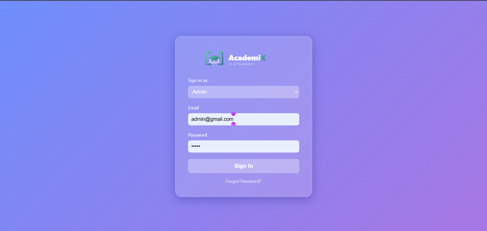
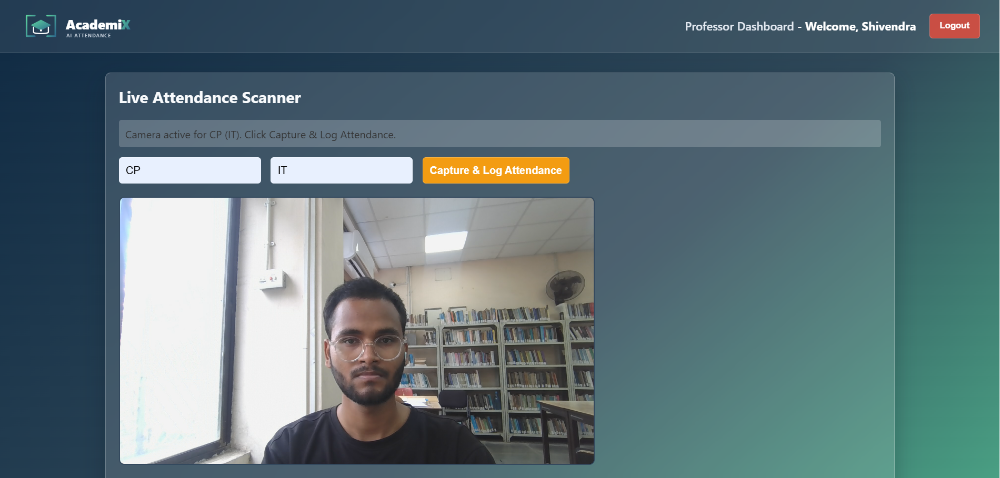
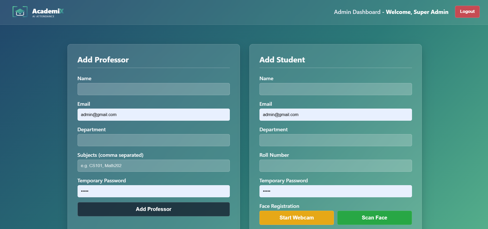
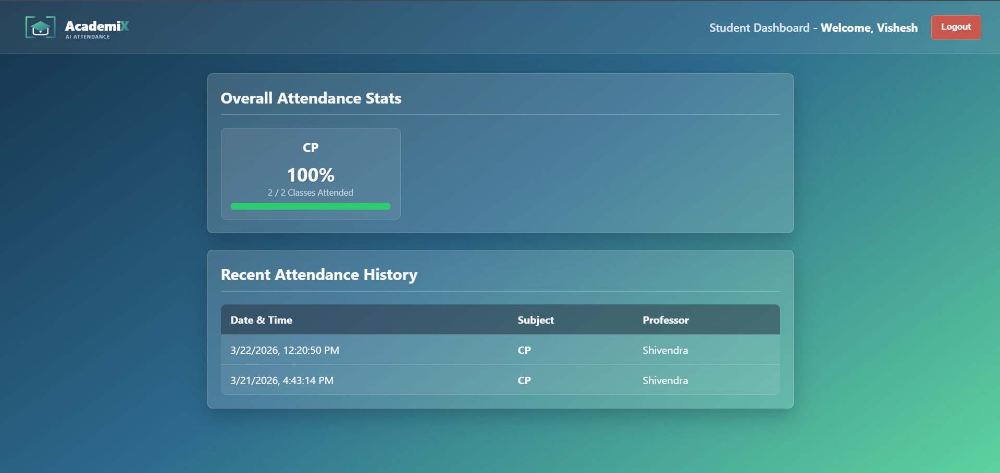

# 🎓 AcademiX: AI-Powered Edge-Computing Attendance System

AcademiX is a full-stack web application engineered to automate classroom roll-calls using machine learning. By architecting an edge-computing solution, the system offloads facial recognition inference directly to the client's browser, completely eliminating server CPU bottlenecks and enabling real-time, mathematical face matching.

##  Key Features

* ** Edge-Computing Machine Learning:** Utilizes `face-api.js` (TensorFlow.js) to extract 128-dimensional facial descriptors and calculate Euclidean distance directly in the browser. 
* ** Real-Time WebSockets:** Integrated **Socket.io** to instantly ping the student's dashboard and trigger browser notifications the exact millisecond their attendance is logged.
* ** Role-Based Access Control (RBAC):** Secure **JWT** authentication and bcrypt password hashing isolating Admin, Professor, and Student routes and dashboards.
* **  Anti-Spam & Data Idempotency:** Custom backend logic prevents duplicate attendance logs within a 1-hour window, ensuring clean database records.
* ** Dynamic Analytics:** Aggregation pipelines in MongoDB dynamically calculate class statistics and attendance percentages in real-time.

##  Tech Stack

* **Frontend:** Vanilla JavaScript, HTML5 Canvas, CSS3 (Glassmorphism UI)
* **Machine Learning:** `face-api.js` (SSD MobileNet V1, 68-Point Face Landmark)
* **Backend:** Node.js, Express.js
* **Real-Time Communication:** Socket.io
* **Database:** MongoDB, Mongoose (Storing 128-D Float32Arrays)
* **Security:** JSON Web Tokens (JWT), Bcrypt.js

##  Architecture Flow

1. **Initialization:** The Professor selects a subject/department. The Node.js server queries MongoDB and pre-fetches the 128-D vector embeddings of all enrolled students, caching them in the browser's memory ($O(1)$ lookups).
2. **Detection:** The client's webcam captures frames via a hidden HTML5 Canvas and processes them through the AI models.
3. **Matching:** The system calculates the Euclidean distance between the live capture and the cached vectors. 
4. **Logging:** If a match threshold is met, a localized POST request is sent to the Express API.
5. **Notification:** The server updates the database and emits a targeted Socket.io payload to the specific student's active session.

## 📸 Project Gallery

### 🖥️ Landing Page
The gateway to AcademiX, featuring a custom SVG logo and modern glassmorphism UI.

---

### 🔍 Professor Dashboard (AI Scanner)
Real-time facial recognition using SSD MobileNet V1. The table at the bottom updates live as students are recognized.

---

### 🛡️ Admin Management Suite
A centralized dashboard for the Admin to perform CRUD operations (Create, Read, Update, Delete) on all users.

---

### 📱 Student Attendance Portal
A personalized view for students to track their attendance history and real-time status via WebSockets.

